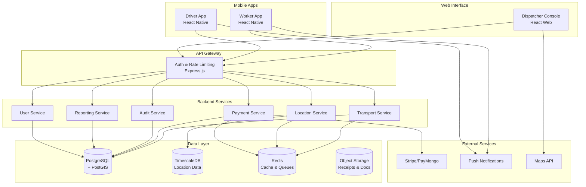
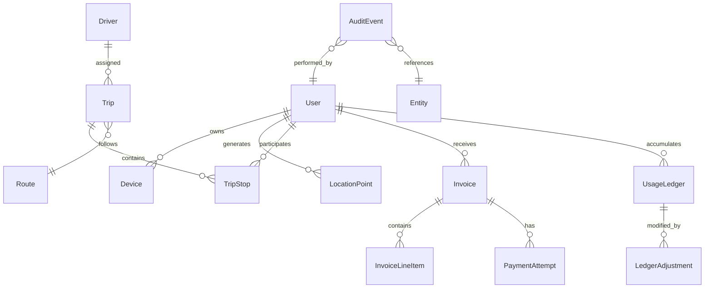

# Design Document

## Overview

The DeCrown Worker Transportation App is designed as a unified backend system with clear service boundaries, supporting real-time location tracking, automated route optimization, and compliant payment processing. The architecture emphasizes security, auditability, and scalability while maintaining operational simplicity through a monolithic deployment that can evolve into microservices.

## Architecture

### High-Level Architecture



### Service Architecture Pattern

The system implements a **Service-Oriented Monolith** pattern:
- Single Node.js application with TypeScript
- Services are separate modules with defined interfaces
- Shared database with service-specific schemas
- Event bus for inter-service communication
- Clear boundaries for future microservices extraction

## Components and Interfaces

### 1. API Gateway Layer

**Responsibilities:**
- JWT token validation and refresh
- Rate limiting per user/endpoint
- Request/response logging
- CORS and security headers
- Route-based service delegation

**Key Interfaces:**
```typescript
interface AuthenticatedRequest extends Request {
  user: {
    id: string;
    role: UserRole;
    permissions: string[];
  };
  correlationId: string;
}

interface RateLimitConfig {
  windowMs: number;
  maxRequests: number;
  skipSuccessfulRequests: boolean;
}
```

### 2. User Service

**Responsibilities:**
- User registration and profile management
- Role-based access control
- Device registration and trust levels
- Consent management for privacy compliance

**Key Interfaces:**
```typescript
interface User {
  id: string;
  email: string;
  role: UserRole;
  department: string;
  status: 'active' | 'suspended' | 'pending';
  consentFlags: ConsentFlags;
  paymentTokenRef?: string;
  createdAt: Date;
  updatedAt: Date;
}

interface ConsentFlags {
  locationTracking: boolean;
  dataProcessing: boolean;
  marketingCommunications: boolean;
  consentVersion: string;
  consentDate: Date;
}
```

### 3. Location Service

**Responsibilities:**
- High-frequency location ingestion with validation
- Geofence monitoring and anomaly detection
- Privacy-compliant data retention
- Real-time location broadcasting to dispatchers

**Key Interfaces:**
```typescript
interface LocationPoint {
  userId: string;
  deviceId: string;
  coordinates: {
    latitude: number;
    longitude: number;
  };
  accuracy: number;
  source: 'gps' | 'network' | 'passive';
  timestamp: Date;
  consentVersion: string;
  hashChain: string; // For tamper detection
}

interface GeofenceRule {
  id: string;
  name: string;
  polygon: GeoJSON.Polygon;
  type: 'pickup_zone' | 'depot' | 'restricted';
  alertOnEntry: boolean;
  alertOnExit: boolean;
}
```

### 4. Transport Service

**Responsibilities:**
- Trip lifecycle management
- Route optimization and driver assignment
- ETA calculations and updates
- Capacity management and scheduling

**Key Interfaces:**
```typescript
interface Trip {
  id: string;
  routeId: string;
  driverId?: string;
  status: TripStatus;
  plannedStops: TripStop[];
  actualStops: TripStop[];
  metrics: TripMetrics;
  createdAt: Date;
  scheduledAt: Date;
  completedAt?: Date;
}

interface TripStop {
  userId: string;
  location: {
    latitude: number;
    longitude: number;
    address?: string;
  };
  estimatedArrival: Date;
  actualArrival?: Date;
  status: 'pending' | 'arrived' | 'picked_up' | 'no_show';
}

interface RouteOptimization {
  algorithm: 'nearest_neighbor' | 'genetic' | 'simulated_annealing';
  constraints: {
    maxStops: number;
    maxDuration: number;
    vehicleCapacity: number;
  };
  result: {
    totalDistance: number;
    estimatedDuration: number;
    optimizationScore: number;
  };
}
```

### 5. Payment Service

**Responsibilities:**
- Monthly usage aggregation and invoicing
- Automated payment processing with retry logic
- Payment method tokenization and security
- Reconciliation and financial reporting

**Key Interfaces:**
```typescript
interface Invoice {
  id: string;
  userId: string;
  billingPeriod: {
    start: Date;
    end: Date;
  };
  lineItems: InvoiceLineItem[];
  totalAmount: number;
  currency: string;
  dueDate: Date;
  status: InvoiceStatus;
  paymentAttempts: PaymentAttempt[];
}

interface UsageLedger {
  userId: string;
  month: string; // YYYY-MM format
  ridesCount: number;
  totalDistance: number;
  totalDuration: number;
  costComponents: {
    baseFare: number;
    distanceFee: number;
    timeFee: number;
    surcharges: number;
  };
  adjustments: LedgerAdjustment[];
}

interface PaymentProvider {
  createCustomer(user: User): Promise<string>;
  tokenizePaymentMethod(paymentData: any): Promise<string>;
  chargeCustomer(customerId: string, amount: number, idempotencyKey: string): Promise<ChargeResult>;
  handleWebhook(payload: any, signature: string): Promise<WebhookEvent>;
}
```

### 6. Audit Service

**Responsibilities:**
- Immutable event logging with correlation tracking
- Tamper-evident audit trails
- Role-based data redaction for exports
- Compliance reporting and data lineage

**Key Interfaces:**
```typescript
interface AuditEvent {
  eventId: string;
  correlationId: string;
  actor: {
    id: string;
    role: string;
    ipAddress?: string;
  };
  action: string;
  entityType: string;
  entityId: string;
  timestamp: Date;
  diff?: {
    before: any;
    after: any;
  };
  metadata: Record<string, any>;
  hashChain: string;
}

interface AuditQuery {
  entityType?: string;
  entityId?: string;
  actorId?: string;
  actions?: string[];
  dateRange: {
    start: Date;
    end: Date;
  };
  includeRedacted: boolean;
}
```

## Data Models

### Core Entity Relationships



### Database Schema Design

**Users Table:**
```sql
CREATE TABLE users (
    id UUID PRIMARY KEY DEFAULT gen_random_uuid(),
    email VARCHAR(255) UNIQUE NOT NULL,
    role user_role NOT NULL,
    department VARCHAR(100),
    status user_status DEFAULT 'pending',
    consent_flags JSONB NOT NULL DEFAULT '{}',
    payment_token_ref VARCHAR(255),
    encrypted_pii BYTEA, -- KMS encrypted personal data
    created_at TIMESTAMP WITH TIME ZONE DEFAULT NOW(),
    updated_at TIMESTAMP WITH TIME ZONE DEFAULT NOW()
);
```

**Location Points (TimescaleDB):**
```sql
CREATE TABLE location_points (
    user_id UUID NOT NULL,
    device_id VARCHAR(100) NOT NULL,
    coordinates GEOGRAPHY(POINT, 4326) NOT NULL,
    accuracy FLOAT NOT NULL,
    source location_source NOT NULL,
    timestamp TIMESTAMP WITH TIME ZONE NOT NULL,
    consent_version VARCHAR(50) NOT NULL,
    hash_chain VARCHAR(64) NOT NULL,
    retention_date DATE NOT NULL
);

SELECT create_hypertable('location_points', 'timestamp');
CREATE INDEX ON location_points (user_id, timestamp DESC);
CREATE INDEX ON location_points USING GIST (coordinates);
```

**Trips and Routes:**
```sql
CREATE TABLE trips (
    id UUID PRIMARY KEY DEFAULT gen_random_uuid(),
    route_id UUID NOT NULL,
    driver_id UUID REFERENCES users(id),
    status trip_status DEFAULT 'planned',
    planned_stops JSONB NOT NULL,
    actual_stops JSONB DEFAULT '[]',
    metrics JSONB DEFAULT '{}',
    created_at TIMESTAMP WITH TIME ZONE DEFAULT NOW(),
    scheduled_at TIMESTAMP WITH TIME ZONE NOT NULL,
    completed_at TIMESTAMP WITH TIME ZONE
);
```

## Error Handling

### Error Classification and Response Strategy

**1. Client Errors (4xx)**
- **Validation Errors:** Return structured field-level errors
- **Authentication Errors:** Return 401 with refresh token guidance
- **Authorization Errors:** Return 403 with minimal information
- **Rate Limiting:** Return 429 with retry-after headers

**2. Server Errors (5xx)**
- **Service Unavailable:** Return 503 with estimated recovery time
- **Database Errors:** Return 500 with correlation ID for tracking
- **External Service Errors:** Return 502 with fallback options
- **Timeout Errors:** Return 504 with partial results if available

### Error Response Format

```typescript
interface ErrorResponse {
  error: {
    code: string;
    message: string;
    correlationId: string;
    timestamp: string;
    details?: Record<string, any>;
    retryable: boolean;
  };
}

// Example validation error
{
  "error": {
    "code": "VALIDATION_FAILED",
    "message": "Request validation failed",
    "correlationId": "req_123456789",
    "timestamp": "2025-11-06T12:00:00Z",
    "details": {
      "fields": {
        "latitude": "Must be between -90 and 90",
        "accuracy": "Must be a positive number"
      }
    },
    "retryable": false
  }
}
```

### Circuit Breaker Pattern

```typescript
interface CircuitBreakerConfig {
  failureThreshold: number;
  recoveryTimeout: number;
  monitoringPeriod: number;
}

class PaymentServiceCircuitBreaker {
  private state: 'closed' | 'open' | 'half-open' = 'closed';
  private failureCount = 0;
  private lastFailureTime?: Date;
  
  async executePayment(operation: () => Promise<any>): Promise<any> {
    if (this.state === 'open') {
      if (this.shouldAttemptRecovery()) {
        this.state = 'half-open';
      } else {
        throw new Error('Payment service unavailable');
      }
    }
    
    try {
      const result = await operation();
      this.onSuccess();
      return result;
    } catch (error) {
      this.onFailure();
      throw error;
    }
  }
}
```

## Testing Strategy

### Testing Pyramid Approach

**1. Unit Tests (70%)**
- Service layer business logic
- Data validation and transformation
- Utility functions and helpers
- Payment calculations and retry logic

**2. Integration Tests (20%)**
- Database operations with real PostgreSQL
- External API integrations (mocked)
- Event bus message handling
- Authentication and authorization flows

**3. End-to-End Tests (10%)**
- Critical user journeys (location sharing, trip completion)
- Payment processing workflows
- Mobile app integration scenarios
- Disaster recovery procedures

### Test Data Management

```typescript
// Test fixture factory for consistent test data
class TestDataFactory {
  static createUser(overrides?: Partial<User>): User {
    return {
      id: faker.datatype.uuid(),
      email: faker.internet.email(),
      role: 'worker',
      department: 'engineering',
      status: 'active',
      consentFlags: {
        locationTracking: true,
        dataProcessing: true,
        marketingCommunications: false,
        consentVersion: '1.0',
        consentDate: new Date()
      },
      createdAt: new Date(),
      updatedAt: new Date(),
      ...overrides
    };
  }
  
  static createTrip(overrides?: Partial<Trip>): Trip {
    return {
      id: faker.datatype.uuid(),
      routeId: faker.datatype.uuid(),
      status: 'planned',
      plannedStops: [],
      actualStops: [],
      metrics: {},
      createdAt: new Date(),
      scheduledAt: faker.date.future(),
      ...overrides
    };
  }
}
```

### Performance Testing

**Load Testing Scenarios:**
- 1000 concurrent location updates per second
- 100 simultaneous route optimizations
- 10,000 monthly invoice generations
- Payment processing under high load

**Monitoring and Alerting:**
- Response time percentiles (p50, p95, p99)
- Error rate thresholds by service
- Database connection pool utilization
- Queue depth and processing lag

### Security Testing

**Automated Security Scans:**
- OWASP dependency checking
- Static code analysis for security vulnerabilities
- API endpoint security testing
- Database injection attack prevention

**Manual Security Reviews:**
- Payment flow security audit
- Location data privacy compliance
- Authentication and session management
- Data encryption and key management

This design provides a solid foundation for the DeCrown Worker Transportation App with clear separation of concerns, robust error handling, and comprehensive testing strategies. The architecture supports the two-day development workflow while ensuring scalability and maintainability for future enhancements.